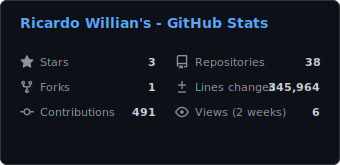
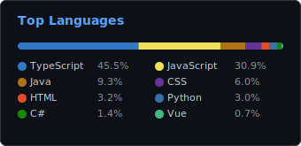
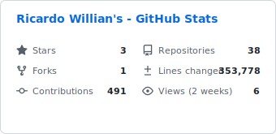
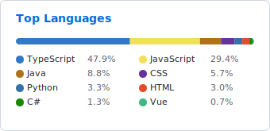

# stats-generator

_Ler em [English](README.md)_

Uma ferramenta moderna e configurável para gerar cards de perfil para GitHub. Crie cartões SVG bonitos, que se atualizam automaticamente, perfeitos para exibir no seu README.

## Visualização

### 🌙 Tema escuro

  
  

### 🔆 Tema claro

  
  

## Recursos

- **Arquitetura modular**: Pacote Python `statsgen` limpo e organizado
- **Configuração flexível**: Arquivos YAML e variáveis de ambiente para customização
- **Templates Jinja2**: Motor profissional para geração de SVGs
- **Modelos tipados**: Estruturas de dados baseadas em dataclasses para maior segurança
- **Suporte CLI**: Execute facilmente com `python -m statsgen` e suas opções
- **Workflow em matriz**: Builds paralelos para múltiplos temas com cache inteligente
- **Temas claro e escuro**: Detecção automática de tema
- **Cores oficiais de linguagens**: Usa paleta do GitHub Linguist para cores consistentes

## Licença

Licenciado sob GPL-3.0 — consulte o arquivo [LICENSE](LICENSE) para mais detalhes.

---

> ⚠️ **Observação:** As estatísticas são armazenadas em cache pelo CDN do GitHub, então pode levar alguns minutos até que as atualizações apareçam.
